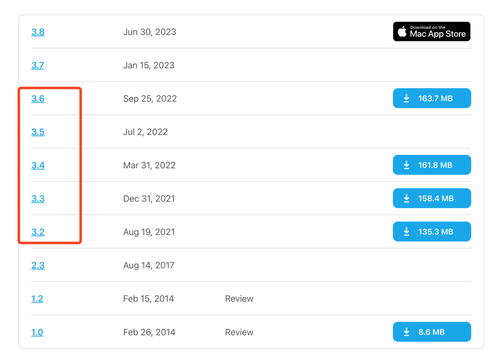
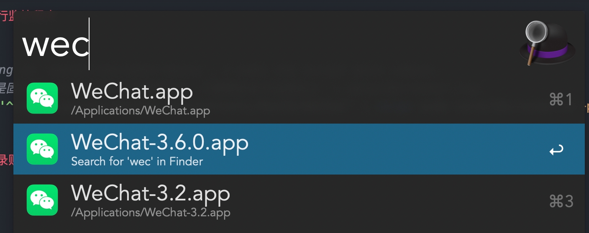
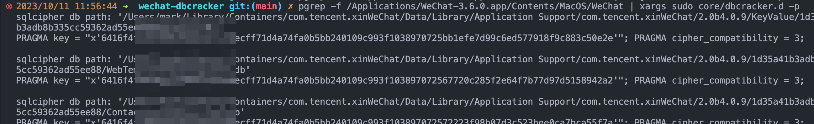

# 微信聊天记录获取之数据库破解


## 项目目标

破解某宿主环境的微信数据库，从而获取其聊天历史记录

## 项目逻辑与原理

### 为什么要从数据库角度出发

如果使用 `wechaty` 之类的微信机器人，只可以 hook 每条实时消息，无法完整获得历史聊天记录。

不过如果在 `wechaty` 的框架内，再加上获取聊天记录的 api，也许是可行的。

而由于微信聊天记录都是存在数据库的，因此可以从数据库角度进行获取。

### 为什么涉及到数据库的破解

因为微信聊天记录是存储在 `sqlcipher` 的，它是支持加密的 `sqlite` 数据库，需要秘钥才能打开，因此我们要首先拿到数据库的秘钥。

### 如何获取数据库的秘钥

以 MacOS 为例，我们可以使用一些逆向手段（`dtrace`）hook 程序的数据库活动，由于程序打开数据库涉及到密钥的读取，我们可以解析这个读取动作，从而获得明文秘钥。
  
### 为什么选择 MacOS 平台

理论上任何平台都可以实现，尤其是 Android、Windows 等平台，逆向工程师更多、破解起来难度可能更小，但我个人的主力机是 Mac/iOS，因此暂时没有考虑兼容 Windows/Android 生态。

其次，PC端的工程能力比移动端要丰富，因此，优先考虑在PC端突破，是性价比较高的选择。

## 环境要求

### 微信版本

目前我们的 dtrace 脚本 以及整个 hook 的逻辑，需要确保 MacOS 微信客户端的版本在 **3.6以下**。

3.8以上不可以，因为微信使用了多进程以及其他技术进行了重构。

3.7 未测试。

微信往期版本的下载地址：https://macdownload.informer.com/wechat/versions/



### sqlcipher 依赖

MacOS 上要配置好能读写 sqlcipher 的环境。

```shell
# 1. check where is your `libcrypto.a`
find /usr/local/Cellar -name libcrypto.a

# 2. use the libcrypto.a with openssl version >= 3
LIBCRYPTO={YOUR-libcrypto.a}

# 3. install sqlcipher
git clone https://github.com/sqlcipher/sqlcipher
bash -c "
cd sqlcipher
./configure --enable-tempstore=yes CFLAGS="-DSQLITE_HAS_CODEC" \
	LDFLAGS=$LIBCRYPTO --with-crypto-lib=none
make && make install
"
```

### 关闭 SIP（可以google一下，需要按住 cmd + shift + R 进入安全模式），otherwise the dtrace can't be used

```shell
# check SIP
csrutil status

# disable SIP, need in recovery mode (hold on shift+R when rebooting)
csrutil disable
```

## 运行，获取秘钥

### 1. 打开mac微信，保持登录页面

### 2. 运行监控程序（注意运行的微信的版本与程序地址）



tip: 需要确保运行正确的、版本对应的微信程序

```shell
# comparing to `wechat-decipher-macos`, I make the script more robust.
# 由于key是固定的，也可以把输出内容持久化，只需要在命令后面加上 `> data/dbcracker.log`
pgrep -f /Applications/WeChat-3.6.0.app/Contents/MacOS/WeChat | xargs sudo core/dbcracker.d -p
```

### 3. 登录账号，确认是否有各种数据库键的输出

tip: 对键的读取动作，会在登录时产生，因此需要先运行程序，再登录。



## 程序化

由于我们已经得到了各个数据库的存储地址、秘钥、版本等，我们便可以程序化的读取所有数据。

- python: 可以使用 `pysqlcipher`
- nodejs: 可以使用 `node-sqlcipher`

## 项目 todo

- [ ] 尝试破解 3.8+ 的微信版本
- [ ] 支持 iOS 端的破解（毕竟基于聊天记录的备份系统，移动端数据会更全）
- [ ] 将整个流程更轻松的自动化
- [ ] 做一个聊天记录展示的UI或者仿微信界面（已经正在进行，但是更希望解耦，可能会另外开个项目，以及需要最终确定是用什么技术栈实现，electron, flutter ?）

## 参考

- 核心破解参考： nalzok/wechat-decipher-macos: DTrace scripts to extract chat history from WeChat on macOS, https://github.com/nalzok/wechat-decipher-macos/tree/main
- D 语言：The D Programming Language, https://docs.oracle.com/en/operating-systems/oracle-linux/dtrace-guide/dtrace-ref-TheDProgrammingLanguage.html#dt_dlang

## Star History

[](https://star-history.com/#markshawn2020/wechat-dbcracker&Date)